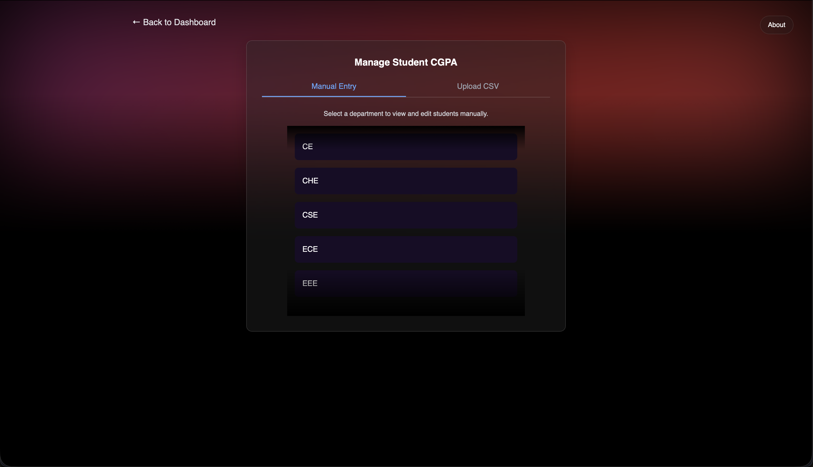
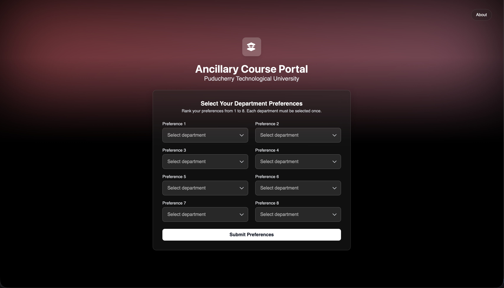
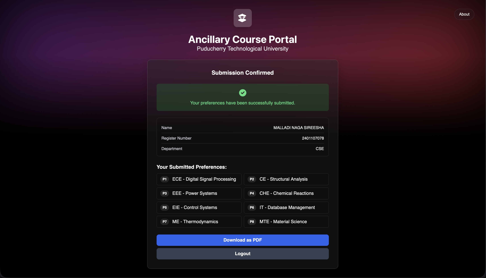

# 📄 Ancillary Course Allocation Portal


> *Your documentation is a direct reflection of your software, so hold it to the same standards.*

After architecting this system and refining its workflow this README documents the complete structure functionality and usage of the Ancillary Course Allocation Portal. This project aims to simplify college ancillary course allocation through automation clean UI and transparent CGPA-based decision-making.

*This guide is geared toward users and developers who need a reliable offline-capable allocation system without relying on heavy university ERP platforms.*


## 🌟 Highlights

I think a *"Highlights"* section is one of the most important to include at the top of a good README. Create a simple, bulleted list of the main selling points of your software.

Here are the main takeaways of this guide:

- Fully offline-capable system (except PDF CDN)
- Clean Student Portal: login CGPA verification and preference submission
- Powerful Admin Portal: course management seat editing CGPA uploads
- Bulk CSV CGPA importer using multer + csv-parser
- Deterministic CGPA-based allocation algorithm
- Professionally formatted PDF receipt for students
- CSV exports for preferences and final allocation
- Lightweight backend using Express and lowdb for a flat-file database
- Simple setup minimal dependencies and easy customization
- Screenshot-rich documentation to help new users understand the system quickly


## ℹ️ Overview

> *A polished README makes your software look credible mature and worth adopting.*

The Ancillary Course Allocation Portal is a Node.js-powered full-stack application designed to streamline ancillary course selection in educational institutions. Students authenticate verify their CGPA select their preference order and download a PDF submission receipt. Admins oversee course lists seat allocations CGPA data submissions and generate final allocation results through a transparent algorithm.

This system fills the gap between overly simple Google Forms workflows and full-scale ERP solutions by offering a focused modern approachable alternative.


### ✍️ Author
I’m [Abhinav Kumar Ilango](https://github.com/abhinavkumarak2005), the developer of this system. This project reflects my goal to build clean well-documented practical tools that solve real academic workflow problems in colleges.

This portal was built to support transparent CGPA-based allocation processes reduce manual workload automate error-prone operations and ensure fairness for every student.


## 🚀 Usage instructions

> *Show off what your software looks like in action using minimal examples and screenshots.*

# CGPA entry

# Preference selection

# Confirmation page


# Student Workflow
	1.	Login using Register Number + Password
	2.	Verify CGPA
	3.	Select and rank 8 course preferences
	4.	Submit
	5.	Download PDF receipt

# Admin Workflow
	1.	Login using the admin portal
	2.	Manage course titles subject IDs and seat counts
	3.	Upload or manually edit CGPA values
	4.	View submission status
	5.	Delete submissions if needed
	6.	Run the allocation algorithm
	7.	Download CSV export of allocation

# ⬇️ Installation instructions

## Install Node.js dependencies:
```py
npm install
```
## Install Python dependencies:
```py
pip install pandas
```
## Generate the database:
```py
python3 build_database.py
```
## Run the server:
```py
node server.js
```
## Portals:
	•	Student Portal → http://localhost:3000
	•	Admin Portal → http://localhost:3000/admin
## Admin password (default):
admin123


It can be tempting to document your entire API in the README, and many projects have done a fantastic job of this like [`tqdm`](https://github.com/tqdm/tqdm/blob/fc69d5dcf578f7c7986fa76841a6b793f813df35/README.rst), but I'd like to mostly discourage this and gear you towards writing actual documentation and leaving the README as an elevator pitch.


## ⬇️ Installation instructions

> *You may be inclined to add development instructions here, **but don't**.*

Having simple, understandable installation instructions is one of **the most important** things to get right in your README. Think about the audience you are going for and try to put yourself in their shoes: *"what is a `git clone`?"*, *"is a PyPI edible?"*, *"who is this whale named Docker?"*, etc.

Most of the time, all you want to do here is show the one-liner to install your project using the relevant package manager:

```bash
pip install pyvista
```

I'm assuming that you are shipping your software off to some package manager; if so, you've made it clear that you intend to reach a wide range of users who likely aren't interested in contributing back to your software. With that in mind, save your development instructions (e.g., `git clone ...; cmake ..`) for the bottom of your README or another document altogether. The people looking for that know how to find it, whereas your average user will be scared off by complicated build instructions.

Additionally, you want to be sure to specify any minimum requirements to run the software here. If it is multiplatform, great, let people know that! If not, specify what platforms this runs on or which versions of Python, etc., are supported.


## 🏆 Examples that inspire me

These are a few projects that I think have very effective READMEs. You look at the README and you can quickly gain what you need to answer the few questions I posed earlier.

There are countless others like these out there, but here are a few I strive to be like:

- [fatiando/pooch](https://github.com/fatiando/pooch)
- [Kitware/ITK](https://github.com/Kitware/ITK)
- [gruns/furl](https://github.com/gruns/furl)
- [marcomusy/vedo](https://github.com/marcomusy/vedo)
- [nschloe/meshio](https://github.com/nschloe/meshio)
- [mher/flower](https://github.com/mher/flower)
- [giampaolo/psutil](https://github.com/giampaolo/psutil)
- [ahupp/python-magic](https://github.com/ahupp/python-magic)
- [curvenote/components](https://github.com/curvenote/components)
- [MonitorControl/MonitorControl](https://github.com/MonitorControl/MonitorControl)


I know you're all looking for an example of a bad README now, so check out [py-filelock](https://github.com/tox-dev/py-filelock/tree/5a39bbb628d573b3776c88aa7dbfed4000a17a09) which only has a link to API docs -- no overview or anything 🤦‍♂️. I feel a little bad calling out a specific project, but you know what, I'm trying to make a point.


## 💭 Invite users to give feedback and contribute

> *If you found this guide insightful or if you have suggestions, please start a [Discussion](https://github.com/banesullivan/README/discussions)!*

When making open source software, you share your work with the world. Whether that is in the hope of contributions back, humbly if just one other person out there finds it useful, or building a community, I think it is important to solicit engagement. To do this, I like to point people over to the Discussions tab or invite them to request new features by opening an issue.

If you want to encourage others to contribute back to your project, this is the place to do it. Point people to your DEVELOPMENT and/or CONTRIBUTING guides if you have them. Further, you can outline any other ways to contribute such as translating the README or documentation.


## 📖 Further reading

- https://github.com/hackergrrl/art-of-readme
- https://www.giacomodebidda.com/articles/how-to-write-a-killer-readme/
